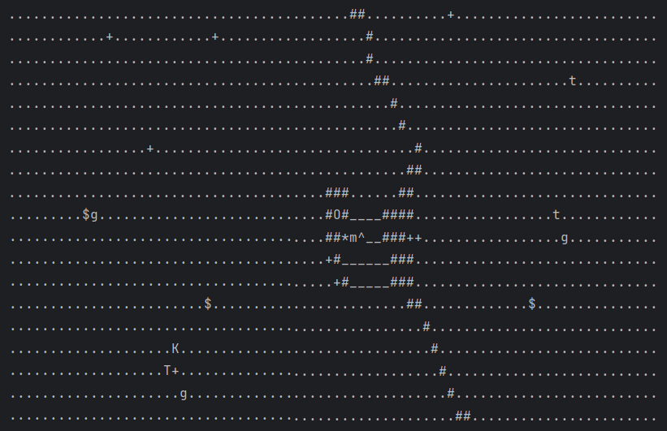

# ASCII-Mario

Turn-based, top-down, rogue-like game inspired by the Super Mario Bros. games.

> The intent of this project is to apply **object oriented principles** to create a fun, scalable game.

## Premise
You play as the titular Mario (`m`) exploring the world, stomping on Goombas and Kappas, jumping on walls and trees, getting power-ups, and buying items from the local merchant, Toad!

## Controls
Mario can move to all 8 adjacent tiles by entering the corresponding alphanumeric character (e.g. `8=North`, `9=North-East`). Some obstacles, such as walls, trees, or enemies cannot be walked on but instead must be jumped on or attacked which will show up as actions when Mario is adjacent to any of these obstacles.

Everyone makes mistakes, including Mario. If you made a bad choice, you can reset the game any time by pressing `r`.

## Coins
Even in the world of Mario you can't escape capitalism, so while adventuring Mario has a wallet on-hand to store his coins. 

You start with 0 coins, but don't worry, in the world of Mario, money *does* grow on trees! Every once in a while a tree might drop a coin and to pick it up, Mario just has to stand on the same tile as a coin and perform the pick-up action.

You can use your newfound wealth to buy some items from the local merchant, [Toad](#toad)!

## Powerups
Mario is incomplete without the powerups, so I reimagined these two iconic powerups:
- Super Mushroom (`^`)
    - Mario becomes BIG! On screen Mario changes from `m` to `M`
    - Max HP increases by 50
    - Mario's jumps now have a 100% success rate.
- Power Star (`*`)
    - Catch them as soon as possible, because these stars fade away after 10 turns
    - Once consumed, Mario becomes INVINCIBLE for 10 turns! Enemy attacks do `0 DMG`.
    - Heals Mario by 200 HP
    - Mario no longer needs to jump over obstacles, he can walk over them to destroy these obstacles!
        - Each destroyed obstacle becomes a dirt tile
        - Each destroyed obstacle also drops a coin.
    - Mario's attacks are now instantly lethal, defeating enemies with one blow!

## Non-Playable Characters (NPCs)
Of course, there are many other entities, both hostile and friendly, roaming around this world. If Mario chooses to engage in combat with a hostile NPC, they will begin to follow Mario and continue attacking until combat ends. If a hostile NPC takes too much `DMG` from Mario, it will despawn from the map.

### [*Hostile*] Goombas (`g`)
- Spawn with `20 HP`
- Kicks Mario dealing `10 DMG` with a `50% hit rate`.

### [*Hostile*] Koopas (`K`)
- Spawns with `100 HP`
- Attacks Mario dealing `30 DMG` with a `50% hit rate`.
- When defeated, it goes into a dormant state (`D`) rendering it unable to attack nor move.
- To truly defeat a Koopa, Mario must equip a `Wrench` to destroy the Koopa's shell.
- A destroyed Koopa shell drops a [*Super Mushroom*](#powerups) (`*`).

### [*Friendly*] Toad (`T`)

- He sets up shop in the middle of the map, protected by brick walls on all sides.
- He sells 3 items in his shop:
    - Wrench ($30)
    - Super Mushroom ($40)
    - Power Star ($60)
- Mario can also talk with Toad who will give some hints to help Mario out on his journey.

## Terrain

- The world is composed of mostly dirt (`.`) which Mario can directly walk on.  
- However, there are also walls (`#`) which Mario must jump on to move past. There is a `90%` chance that Mario succeeds at wall jumps but if he's out of practice he could miss the jump and fall. This deals `10 DMG` to Mario, *OUCH!*

### Trees
The world would be pretty boring without some greenery, so the world contains dynamic trees with growth cycles:
- Sprout (`+`)
    - When the game begins, sprouts are randomly spawned around the map.
    - Every turn there is a `10% chance` to spawn a Goomba.
    - After 10 turns, a sprout grows into a sapling.
- Sapling (`t`)
    - Every turn there is a `10% chance` to spawn a coin.
    - After 10 turns, a sapling grows into a tree.
- Tree (`T`)
    - Every turn there is a `15% chance` to spawn a Koopa.
    - Every turn there is a `20% chance` that the tree withers and turns into a dirt tile.
    - After every 5 turns, a new sprout grows on an empty dirt tile around the tree. 
